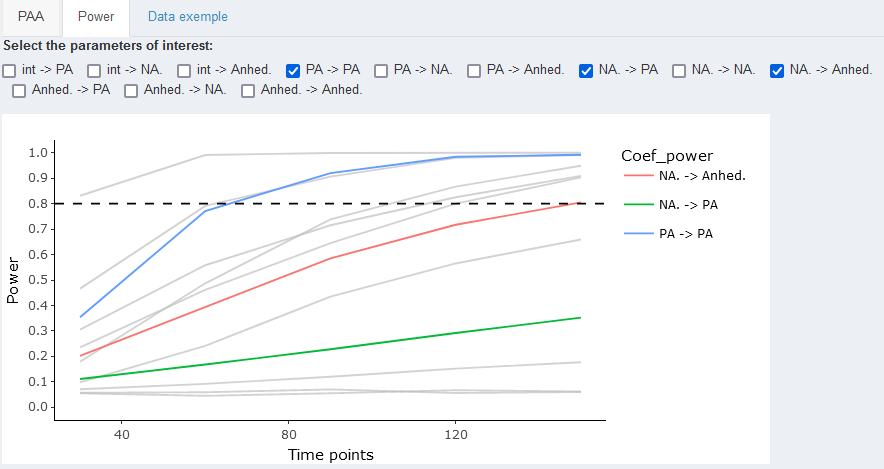
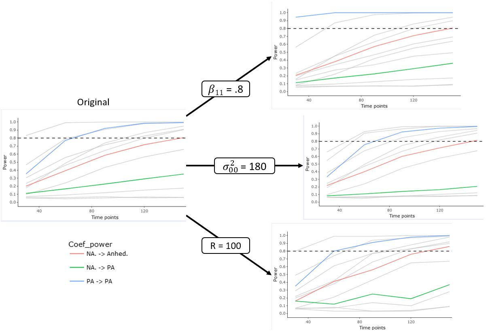
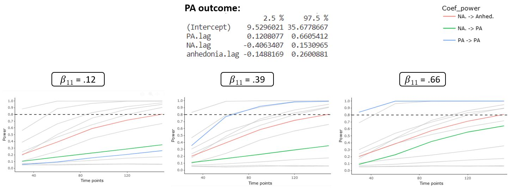
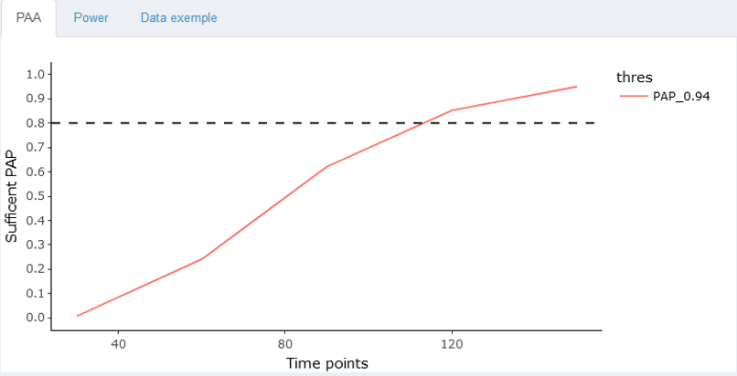
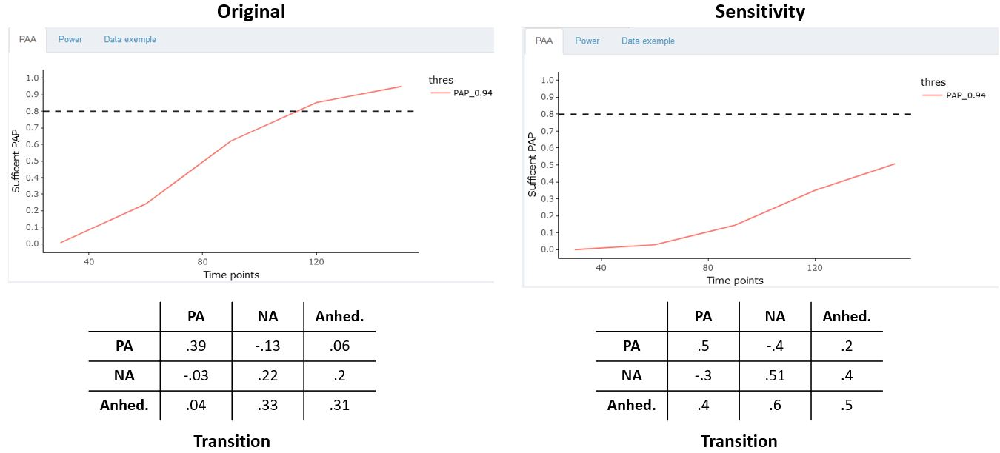

## Settings things up

Before we proceed, we need to ensure we have several packages installed and
loaded into our `R` session. For the scripts below, we will use the following
packages:

- [`data.table`](https://CRAN.R-project.org/package=data.table)
- [`psych`](https://CRAN.R-project.org/package=psych)
- [`tidyverse`](https://CRAN.R-project.org/package=tidyverse)
- [`MASS`](https://CRAN.R-project.org/package=MASS)

Which we can install in one go as follows:

```{r}
#| name: install-packages
#| echo: true
#| eval: false
#| warning: false

# Prepare the package list.
packages = c("data.table", "psych", "tidyverse", "MASS")

# Install packages.
install.packages(packages)
```

::: {.callout-tip}
You may consider first checking if the packages are installed before
actually installing them. Nevertheless, the code above will not reinstall
packages that are already installed and up-to-date.
:::

Now that we have all packages installed, we continue by loading them.

```{r chunk-libraries, echo=TRUE, warning=TRUE, results="hide", message=FALSE}
# To create lagged outcome variables.
library(data.table)

# To compute descriptive statistics.
library(psych)

# A useful package.
library(tidyverse)

# Handy functions for data analysis.
library(MASS)

# Set a seed for reproducibility.
set.seed(123)
```

## Description

We use data from @heininga2019dynamical. This study applies the ESM methodology
to study emotion dynamics in people with *Major Depressive Disorder* (MDD). The
study consist of an ESM testing period of seven days in which participants had
to fill out questions about mood and social context on their daily lives ten
times a day (i.e., $70$ measurement occasions). The data set contains $38$
participants diagnosed with MDD and $40$ control subjects. Participants filled
out the ESM questionnaires in a stratified random interval scheme between 9:30
AM and 9:30 PM.

First, we are going to load the data set:

```{r}
#| name: load-data
#| echo: true
#| eval: true

# Load the data set.
load(file = "assets/data/clinical-dataset.RData")
```

::: {.callout-tip}
Make sure you load the data from the location where you downloaded it. If your
analysis script (i.e., the `.R` file) and the dataset are in the same location,
than you can simply load the data as follows:

```r
load(file = "clinical-dataset.RData")
```
:::

## Data exploration

In this section we will explore briefly the variables in the data set.

### Data structure

Now, that we have the data ready, we can start by exploring it to get a better
understanding of the variable measured.

```{r}
#| name: data-subset
#| echo: true
#| eval: true

# Select the first participant diagnosed with MDD.
i.ID <- unique(data$PID[data$MDD == 1])[1]

# Select data from participant with person identification number `101`.
data <- data[data$PID == 101, ]
```

::: {.callout-note}
From now on we will work with data from participant `101` only. In other words,
`data` is now a subset of the original data set, containing only the responses
from participant `101`.
:::

```{r}
#| name: data-exploration
#| echo: true
#| eval: true

# Find the dimensions.
dim(data)

# Find the structure.
str(data)

# See the first 6 rows.
head(data)

# See the last 6 rows.
tail(data)

# Find the column names.
names(data)

# Summary of the data.
summary(data)

# Number of participants.
length(unique(data$PID))
```

The data set contains the following variables:

- `PID` that denotes the individual identification number
- `day` is a variable that ranges from 1 to 7 and identifies the day of ESM
  testing
- `daybeep` is a variable that ranges from 1 to 10 and identifies the number of
  the prompt or beep within a day
- `PA` is the *Positive Affect* computed as the mean of items:
  - *How happy do you feel at the moment?*
  - *How relaxed do you feel at the moment?*
  - *How euphoric do you feel at the moment?*
- `NA.` is the *Negative Affect* computed as the mean of items:
  - *How depressed do you feel at the moment?*
  - *How stressed do you feel at the moment?*
  - *How anxious do you feel at the moment?*
  - *How angry do you feel at the moment?*
  - *How restless do you feel at the moment?*
- `anhedonia` corresponds to the ESM item:
  - *To what degree do you find it difficult to experience pleasure in
    activities at the moment?*
- `MDD` is a dummy variable equal to one when the individual has been diagnosed
  with MDD and 0 otherwise
- `QIDS` denotes the sum of the items of the *Quick Inventory of Depressive
  Symptomatology* [QIDS\; @rush200316]. QIDS was measured before the ESM testing
  period.

::: {.callout-note}
Time-varying variables (PA, NA, and anhedonia) have been lagged within days to
account for the night breaks.
:::

### Descriptive statistics and visualizations

We first obtain some descriptive statistics including number of observations per
day, and compliance.

```{r}
#| name: descriptive-stats-compliance
#| echo: true
#| eval: true

# Get the number of assessment per day.
table(data$PID)

# Compute a binary variable indicating if a participant answered a beep. We take
# the ESM item PA as reference because in this ESM design participants were not
# allowed to skip items.
data$Compliance <- ifelse(is.na(data$PA) == FALSE, 1, 0)

# Mean, median of the compliance for the participant PID=101
describe(data$Compliance)
```

Next, we can obtain visualizations and statistics of the distribution of the
person-level or time-invariant variables variables.

```{r}
#| name: descriptive-stats-time-invariant-variables
#| echo: true
#| eval: true

# We create a data set that will aggregate the data by the time invariant
# variables, i.e., the MDD diagnosis and QIDS depression score.
dt.person = aggregate(
    cbind(data$MDD, data$QIDS),
    by = list(data$PID),
    mean,
    na.rm = TRUE
)

# Add column names to the aggregated data set.
colnames(dt.person) = c("Group.1", "MDD", "QIDS")

# Print the aggregated data set.
dt.person
```

We now focus on time-varying variables NA, PA, and anhedonia and we obtain
visualization and descriptive statistics

```{r}
#| name: descriptive-stats-time-variant-variables
#| echo: true
#| eval: true
#| fig-align: center
#| warning: false

# Histogram for the time-varying variable negative affect (NA.).
ggplot(data, aes(NA.)) +
    geom_histogram(
        color = "black",
        fill = "white",
        bins = 30
    ) +
    theme_bw()

# Descriptive statistics for NA.
describe(data$NA.)

# Create obs order variable.
data$obs = 1:nrow(data)

# Plot the trajectories of the time-varying variable NA by person.
data %>%
    ggplot(aes(x = obs, y = NA.)) +
    geom_point() +
    geom_line() +
    theme_bw()

# Histogram for the time-varying variable negative affect (PA).
ggplot(data, aes(PA)) +
    geom_histogram(
        color = "black",
        fill = "white",
        bins = 30
    ) +
    theme_bw()

# Descriptive statistics for PA.
describe(data$PA)

# Plot the trajectories of the time-varying variable PA by person.
data %>%
    ggplot(aes(x = obs, y = PA)) +
    geom_point() +
    geom_line() +
    theme_bw()

# Histogram for the time-varying variable anhedonia.
ggplot(data, aes(anhedonia)) +
    geom_histogram(
        color = "black",
        fill = "white",
        bins = 30
    ) +
    theme_bw()

# Descriptive statistics for anhedonia.
describe(data$anhedonia)

# Plot the trajectories of the time-varying variable anhedonia by person.
data %>%
    ggplot(aes(x = obs, y = anhedonia)) +
    geom_point() +
    geom_line() +
    theme_bw()
```

## Data preparation

At this point, we are almost ready to start estimating our models. The last step
before doing that, is creating the lagged version of the variables `PA` and
`NA.`. They will be used on the subsequent $\text{AR}(1)$ and $\text{VAR}(1)$
models we fit below.

```{r}
#| name: data-preparation
#| echo: true
#| eval: true
#| warning: false

# Create lagged variables.
# Lagged within days to take into account night breaks.
data$PA.lag <- rep(NA, nrow(data))
data$NA.lag <- rep(NA, nrow(data))
data$anhedonia.lag <- rep(NA, nrow(data))
day.id <- unique(data$day)

for (t in day.id) {
    data$PA.lag[which(data$day == t)] <- shift(data$PA[which(data$day == t)], 1)
    data$NA.lag[which(data$day == t)] <- shift(data$NA.[which(data$day == t)], 1)
    data$anhedonia.lag[which(data$day == t)] <- shift(data$anhedonia[which(data$day == t)], 1)
}
```

## Estimating $\text{AR}(1)$ for PA

We estimate an $\text{AR}(1)$ model for PA using a linear regression model
(ordinary least squares, OLS). You can extract the estimates with the
`summary()` function. Finally, you can compute the estimate of the standard
deviation of the errors of the $\text{AR}(1)$ model computing the standard
deviation using the function `sd()` on the residuals of the fitted model.

```{r}
#| name: ar-model-pa
#| echo: true
#| eval: true
#| warning: false

# Fit AR(1) model for PA.
fit.AR.PA <- lm(PA ~ 1 + PA.lag, data = data)

# Show fit summary.
summary(fit.AR.PA)

# Estimate the standard deviation of the errors.
sd(residuals(fit.AR.PA))
```

## Estimating $\text{VAR}(1)$ for PA and NA

We estimate a $\text{VAR}(1)$ model for PA and NA using two separate linear
regression models. You can extract the estimates with the `summary()` function.
Finally, you can compute the estimate of the variance-covariance matrix of the
errors of the $\text{VAR}(1)$ model computing the covariance matrix using the
function `cov()` on the residuals of each of the fitted models.

```{r}
#| name: var-model-pa-na
#| echo: true
#| eval: true
#| warning: false

# Linear regression model for PA.
fit.VAR.PA = lm(PA ~ 1 + PA.lag + NA.lag, data = data)

# Linear regression model for NA.
fit.VAR.NA = lm(NA. ~ 1 + PA.lag + NA.lag, data = data)

# Show fit summary for PA.
summary(fit.VAR.PA)

# Show fit summary for NA.
summary(fit.VAR.NA)

# Estimate variance-covariance matrix of the errors.
res = cbind(residuals(fit.VAR.PA),residuals(fit.VAR.NA))

# Print the covariance matrix.
cov(res)
```

## Estimating $\text{VAR}(1)$ model for NA, PA and anhedonia

We estimate a $\text{VAR}(1)$ model for PA, NA and anhedonia using three
separate linear regression models. You can extract the estimates with the
`summary()` function. Finally, you can compute the estimate of the
variance-covariance matrix of the errors of the $\text{VAR}(1)$ model by
computing the covariance matrix using the function `cov()` on the residuals of
each of the fitted models.

```{r}
#| name: var-model-pa-na-anhedonia
#| echo: true
#| eval: true
#| warning: false

# Linear regression model for PA.
fit.VAR.PA = lm(PA ~ 1 + PA.lag + NA.lag + anhedonia.lag, data = data)

# Linear regression model for NA.
fit.VAR.NA = lm(NA. ~ 1 + PA.lag + NA.lag + anhedonia.lag, data = data)

# Linear regression model for anhedonia.
fit.VAR.anhedonia = lm(anhedonia ~ 1 + PA.lag + NA.lag + anhedonia.lag, data = data)

# Show fit summary for PA.
summary(fit.VAR.PA)

# Show fit summary for NA.
summary(fit.VAR.NA)

# Show fit summary for anhedonia.
summary(fit.VAR.anhedonia)

# Estimate variance-covariance matrix of the errors.
res = cbind(residuals(fit.VAR.PA),residuals(fit.VAR.NA),residuals(fit.VAR.anhedonia))

# Print the covariance matrix.
cov(res)
```

## Running the `Shiny` application

The `Shiny` application is associated to a package that is stored at
[gitlab.kuleuven.be/ppw-okpiv/researchers/u0148925/shinyapp-paa_var_n1](https://gitlab.kuleuven.be/ppw-okpiv/researchers/u0148925/shinyapp-paa_var_n1).
To install the package and run the `Shiny` app, you can use the following `R`
code:

```{r}
#| name: running-shiny-app
#| echo: true
#| eval: false

# Install the package containing the application.
remotes::install_gitlab(
    "ppw-okpiv/researchers/u0148925/shinyapp-paa_var_n1",
    host = "https://gitlab.kuleuven.be",
    force = TRUE
)

# Import the package containing the application.
library(paavar1)

# Run the shiny app.
run_paa_var1()
```

## Power analysis for $\text{VAR}(1)$ with three variables

::: {.callout-tip title="Exercise"}
Try on your own and compare your results to the ones presented below!
:::

### Power analysis result

Running the simulation with the application, you should end up with a similar
plot as the one below.



### Sensitivity analysis for power: varying parameters

We slightly changed the values of three coefficients to investigate how they
change either the sample size recommendation or the precision of estimates:

- $\beta_{11} = .39$ to $\beta_{11} = .8$
- $\sigma_{00} = 90$ to $\sigma_{00} = 180$
- $R = 1000$ to $R = 100$

::: {.callout-tip title="Exercise"}
What conclusions can you draw based on the following power curves?
:::



### Sensitivity analysis for power: using CI

Following Lafit, Revol et al. (under review), we run a sensitivity analysis
using the upper and lower boundaries of the estimated coefficients of interest.
First, we extract the 95% confidence interval of the estimated values of each
parameter.

```{r}
#| echo: true
#| eval: false

# Linear regression model for PA.
confint(fit.VAR.PA, level = 0.95)

# Linear regression model for NA.
confint(fit.VAR.NA, level = 0.95)

# Linear regression model for anhedonia.
confint(fit.VAR.anhedonia, level = 0.95)
```

We only varied the parameter values for the auto-regressive effect of PA
($\beta_{11}$) following the confidence interval. We run two new power analyses.
The results are displayed below.



::: {.callout-tip title="Exercise"}
What conclusions can you draw based on the following power curves?
:::

## PAA for $\text{VAR}(1)$ with three variables

::: {.callout-tip title="Exercise"}
Try on your own and compare your results to the ones presented below!
:::

### PAA result

Running the simulation with the application, you should end up with a similar
plot as the one below.



### Sensitivity analysis for power: varying parameters

We changed the values of the transition matrix to investigate how it changes the
sample size recommendation.



::: {.callout-tip title="Exercise"}
What conclusions can you draw based on the following power curves?
:::

::: {.callout-note}
Despite the raising of the coefficients, the new transition matrix still
fulfills the stationary assumption. Higher coefficients could lead to a
violation of this assumption.
:::

## Session information

Using the command below, we can print the `session` information (i.e., operating
system, details about the `R` installation, and so on) for reproducibility
purposes.

:::{.code-font-small}
```{r}
#| name: session-info
#| echo: true
#| eval: true
#| warning: false

# Session information.
sessionInfo()
```
:::

## References
