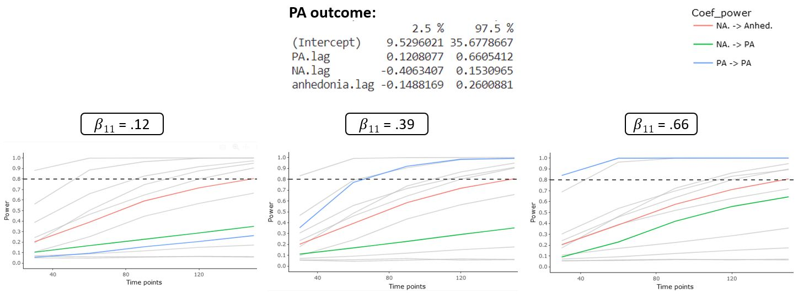

```{r setup, include=FALSE}
knitr::opts_chunk$set(echo = TRUE)
```

## Setup the environment

The code below chunk simply makes sure that all the libraries used here are
installed. We should first check if the `R` packages are installed before we
proceed.

```{r chunk-install-package, echo=TRUE, warning=TRUE, results="hide", message=FALSE}
## Do not run because we do not want to install packages (this should be your decision)

list.of.packages = c("data.table","psych","ggplot2","tidyverse","MASS")
new.packages = list.of.packages[!(list.of.packages %in% installed.packages()[,"Package"])]
if(length(new.packages)) install.packages(new.packages)
```

Now that we have all packages installed, we continue by loading them.

```{r chunk-libraries, echo=TRUE, warning=TRUE, results="hide", message=FALSE}
library(data.table) # to create lagged outcome
library(psych) # to compute descriptive statistics
library(ggplot2) # for making plots
library(tidyverse) # a useful package

library(MASS)

set.seed(1235) # Set a seed to reproduce analyses
```

## The Leuven clinical study data set

We use data from Heininga et al. (2019); this study applies the ESM methodology
to study emotion dynamics in people with Major Depressive Disorder. The study
consist of an ESM testing period of 7 days in which participants had to fill out
questions about mood and social context on their daily lives ten times a day
(i.e., 70 measurement occasions). The data set contains 38 participants
diagnosed with MDD and 40 control subjects. Participants filled out the ESM
questionnaires in a stratified random interval scheme between 9:30 AM and 9:30
PM.

First, we are going to load the data set:

```{r echo=TRUE}
# Load data set
load(file="assets/data/clinical-dataset.RData")
```

Now, we are going to explore the data set to get a better understanding of the
what's inside.

```{r chunk-load-data, echo=TRUE}
# Select the first participant diagnosed with major depressive
i.ID = unique(data$PID[data$MDD==1])[1]

# Select data from participant with person identification number PID=101
data = data[data$PID==101,]

# Find the dimensions
dim(data)

# Find the structure
str(data)

# See the first 6 rows
head(data)

# See the last 6 rows
tail(data)

# Find the column names
names(data)

# Summary of the data
summary(data)

# Number of participants
length(unique(data$PID))
```

The data set contains the following variables: `PID` that denotes the individual
identification number, `day` is a variable that ranges from 1 to 7 and
identifies the day of ESM testing, `daybeep` is a variable that ranges from 1 to
10 and identifies the number of the prompt or beep within a day. `PA` is the
Positive Affect computed as the mean of items: 'How happy do you feel at the
moment?', 'How relaxed do you feel at the moment?' and 'How euphoric do you feel
at the moment?'. `NA.` is the Negative Affect computed as the mean of items:
'How depressed do you feel at the moment?', 'How stressed do you feel at the
moment?', 'How anxious do you feel at the moment?', 'How angry do you feel at
the moment?' and 'How restless do you feel at the moment?'. `anhedonia`
corresponds to the ESM item 'To what degree do you find it difficult to
experience pleasure in activities at the moment?'. `MDD` is a dummy variable
equal to one when the individual has been diagnosed with MDD and 0 otherwise,
finally `QIDS` denotes the sum of the items of the Quick Inventory of Depressive
Symptomatology (i.e. QIDS) [@rush200316]. QIDS was measured before the ESM
testing period. Time-varying variables (PA, NA, and anhedonia) have been lagged
within days to account for the night breaks.

## Visualizations and descriptive statistics

We first obtain some descriptive statistics including number of observations per
day, and compliance.

```{r chunk-descriptive-stats-compliance, echo = TRUE}
# Get the number of assessment per day
table(data$PID)

# Compute a binary variable indicating if a participant answered a beep. We take
# the ESM item PA as reference because in this ESM design participants were not
# allowed to skip items
data$Compliance = ifelse(is.na(data$PA)==FALSE, 1, 0)

# Mean, median of the compliance for the participant PID=101
describe(data$Compliance)
```

Next, we can obtain visualizations and statistics of the distribution of the person-level or time-invariant variables variables

```{r chunk-descriptive-stats-time-invariant-variables, echo = TRUE}
# We create a data set that will aggregate the data from the time invariant
# variables: diagnosis (1 = MDD, 0 = control) and depression (QIDS)
dt.person = aggregate(cbind(data$MDD,data$QIDS), by = list(data$PID), mean, na.rm = TRUE)
colnames(dt.person) = c("Group.1","MDD","QIDS")
dt.person
```

We now focus on time-varying variables NA, PA, and anhedonia and we obtain
visualization and descriptive statistics

```{r chunk-descriptive-stats-time-variant-variables, echo = TRUE}
#| fig-align: center

# Histogram for the time-varying variable negative affect (NA.)
ggplot(data, aes(NA.)) + geom_histogram(color="black", fill="white",bins=30) + theme_bw()

# Descriptive statistics for NA.
describe(data$NA.)

# Create obs order variable
data$obs = 1:nrow(data)

# Plot the trajectories of the time-varying variable NA by person
data %>%
  ggplot(aes(x = obs, y = NA.)) +
  geom_point() +
  geom_line() + theme_bw()

# Histogram for the time-varying variable negative affect (PA)
ggplot(data, aes(PA)) + geom_histogram(color="black", fill="white",bins=30) + theme_bw()

# Descriptive statistics for PA
describe(data$PA)

# Plot the trajectories of the time-varying variable PA by person
data %>%
  ggplot(aes(x = obs, y = PA)) +
  geom_point() +
  geom_line() + theme_bw()

# Histogram for the time-varying variable anhedonia
ggplot(data, aes(anhedonia)) + geom_histogram(color="black", fill="white",bins=30) + theme_bw()

# Descriptive statistics for anhedonia
describe(data$anhedonia)

# Plot the trajectories of the time-varying variable anhedonia by person
data %>%
  ggplot(aes(x = obs, y = anhedonia)) +
  geom_point() +
  geom_line() + theme_bw()
```

Finally, we create the lagged variables for PA and NA. They will be used on the
following $\text{AR}(1)$ and $\text{VAR}(1)$ models.

```{r, echo=TRUE, warning=FALSE, eval=TRUE}
# Create lagged variables: lagged within days to take into account night breaks
data$PA.lag = rep(NA,nrow(data))
data$NA.lag = rep(NA,nrow(data))
data$anhedonia.lag = rep(NA,nrow(data))
day.id = unique(data$day)
for (t in day.id){
  data$PA.lag[which(data$day==t)] = shift(data$PA[which(data$day==t)],1)
  data$NA.lag[which(data$day==t)] = shift(data$NA.[which(data$day==t)],1)
  data$anhedonia.lag[which(data$day==t)] = shift(data$anhedonia[which(data$day==t)],1)
}
```


## 1. Estimate the $\text{AR}(1)$ model for PA

We estimate an $\text{AR}(1)$ model for PA using a linear regression model (ordinary
least squares, OLS). You can extract the estimates with the 'summary()'
function. Finally, you can compute the estimate of the standard deviation of the
errors of the $\text{AR}(1)$ model computing the standard deviation using the function
'sd()' on the residuals of the fitted model.

```{r chunk-Example-1-AR-model-PA, echo = TRUE}
# AR(1) model for PA
fit.AR.PA = lm(PA ~ 1 + PA.lag, data = data)
summary(fit.AR.PA)

# Estimate the standard deviation of the errors
sd(residuals(fit.AR.PA))
```


## 2. Estimate the $\text{VAR}(1)$ model for PA and NA

We estimate a $\text{VAR}(1)$ model for PA and NA using two separate linear
regression models. You can extract the estimates with the 'summary()' function.
Finally, you can compute the estimate of the variance-covariance matrix of the
errors of the $\text{VAR}(1)$ model computing the covariance matrix using the
function 'cov()' on the residuals of each of the fitted models.

```{r chunk-Example-3-VAR-model-PA-NA, echo = TRUE}
# Linear regression model for PA
fit.VAR.PA = lm(PA ~ 1 + PA.lag + NA.lag, data = data)
summary(fit.VAR.PA)

# Linear regression model for NA
fit.VAR.NA = lm(NA. ~ 1 + PA.lag + NA.lag, data = data)
summary(fit.VAR.NA)

# Estimate variance-covariance matrix of the errors
res = cbind(residuals(fit.VAR.PA),residuals(fit.VAR.NA))
cov(res)
```

## 3. Estimate the $\text{VAR}(1)$ model for NA, PA and Anhedonia

We estimate a $\text{VAR}(1)$ model for PA, NA and anhedonia using three
separate linear regression models. You can extract the estimates with the
'summary()' function. Finally, you can compute the estimate of the
variance-covariance matrix of the errors of the $\text{VAR}(1)$ model by
computing the covariance matrix using the function 'cov()' on the residuals of
each of the fitted models.

```{r chunk-Exercise-4-VAR-model-PA-NA-anhedonia, echo = TRUE}
# Linear regression model for PA
fit.VAR.PA = lm(PA ~ 1 + PA.lag + NA.lag + anhedonia.lag, data = data)
summary(fit.VAR.PA)

# Linear regression model for NA
fit.VAR.NA = lm(NA. ~ 1 + PA.lag + NA.lag + anhedonia.lag, data = data)
summary(fit.VAR.NA)

# Linear regression model for anhedonia
fit.VAR.anhedonia = lm(anhedonia ~ 1 + PA.lag + NA.lag + anhedonia.lag, data = data)
summary(fit.VAR.anhedonia)

# Estimate variance-covariance matrix of the errors
res = cbind(residuals(fit.VAR.PA),residuals(fit.VAR.NA),residuals(fit.VAR.anhedonia))
cov(res)
```

## How to run the shiny app?

The shiny application is associated to a package that is stored here:
https://gitlab.kuleuven.be/ppw-okpiv/researchers/u0148925/shinyapp-paa_var_n1.
To install the package and run the shiny app, please use the following R code in
a new script or in a R terminal:

```{r, eval=FALSE}
# Install the package
remotes::install_gitlab("ppw-okpiv/researchers/u0148925/shinyapp-paa_var_n1", host="https://gitlab.kuleuven.be", force=TRUE)

# Import the package in the R session
library(paavar1)

# Run the shiny app
run_paa_var1()
```

## Exercise: Power analysis of $\text{VAR}(1)$ with 3 variables

### Power analysis result

Running the simulation with the application, you should end up with a similar
plot:


### Sensitivity analysis for power: varying parameters

We slightly changed the values of three coefficients to investigate how they
change either the sample size recommendation or the precision of estimates:

- $\beta_{11} = .39$ to $\beta_{11} = .8$
- $\sigma_{00} = 90$ to $\sigma_{00} = 180$
- $R = 1000$ to $R = 100$

What conclusions can you draw based on the following power curves?


### Sensitivity analysis for power: using CI

Following Lafit, Revol et al. (under review), we run a sensitivity analysis
using the upper and lower boundaries of the estimated coefficients of interest.
First, we extract the 95% confidence interval of the estimated values of each
parameter.

```{r}
# Linear regression model for PA
confint(fit.VAR.PA, level=0.95)

# Linear regression model for NA
confint(fit.VAR.NA, level=0.95)

# Linear regression model for anhedonia
confint(fit.VAR.anhedonia, level=0.95)
```

We only varied the parameter values for the auto-regressive effect of PA
($\beta_{11}$) following the confidence interval. We run two new power analyses.
The results are displayed below. What conclusions can you draw based on the
following power curves?



## Exercise: PAA of $\text{VAR}(1)$ with 3 variables

### PAA result

Running the simulation with the application, you should end up with a similar
plot:


### Sensitivity analysis for power: varying parameters

We changed the values of the transition matrix to investigate how it changes the
sample size recommendation. What conclusions can you draw based on the following
power curves?


Note that, despites the raising of the coefficients, the new transition matrix
still fulfills the stationary assumption. Higher coefficients could lead to a
violation of this assumption.

## Get the session info

Below we provide the `session` information (i.e., operating system, details
about the `R` installation, and so on) for reproducibility purposes.

```{r chunk-session-info, echo = TRUE}
sessionInfo()
```
